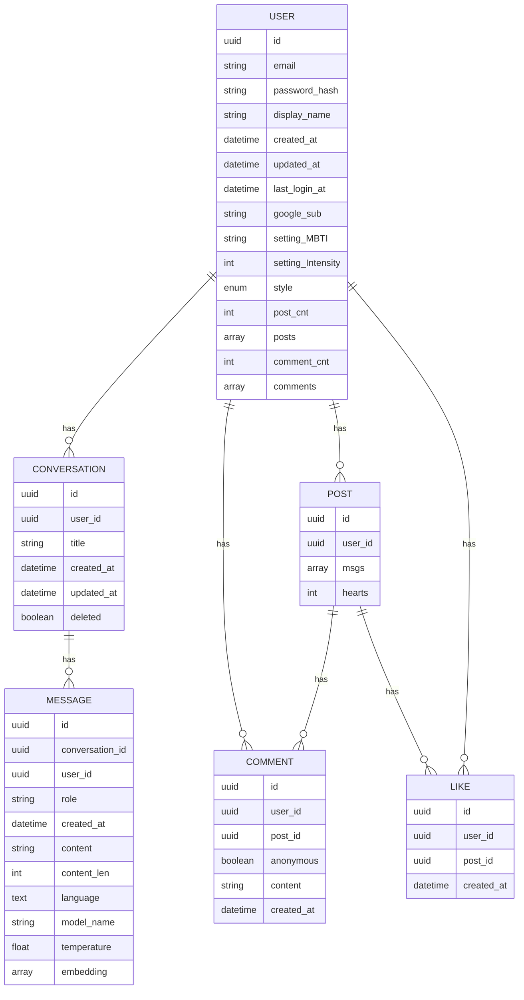

# immersion-camp-week2

## DB ERD

```mermaid
erDiagram
  USER ||--o{ CONVERSATION : has
  CONVERSATION ||--o{ MESSAGE : has
  USER ||--o{ POST : has
  USER ||--o{ COMMENT : has
  POST ||--o{ COMMENT : has
  POST ||--o{ LIKE : has
  USER ||--o{ LIKE : has
  
  
  USER {
    uuid id
    string email
    string password_hash
    string display_name
    datetime created_at
    datetime updated_at
    datetime last_login_at
    string google_sub
    string setting_MBTI
    int setting_Intensity
    enum style
    int post_cnt
    array posts
    int comment_cnt
    array comments
  }

  CONVERSATION {
    uuid id
    uuid user_id
    string title
    datetime created_at
    datetime updated_at
    boolean deleted
  }

  MESSAGE {
    uuid id
    uuid conversation_id
    uuid user_id
    string role
    datetime created_at

    string content

    int content_len
    text language
    string model_name
    float temperature
    array embedding
  }

  POST {
    uuid id
    uuid user_id
    array msgs
    int hearts
  }

  LIKE {
    uuid id
    uuid user_id
    uuid post_id
    datetime created_at
  }

  COMMENT {
    uuid id
    uuid user_id
    uuid post_id
    boolean anonymous
    string content
    datetime created_at
  }
```